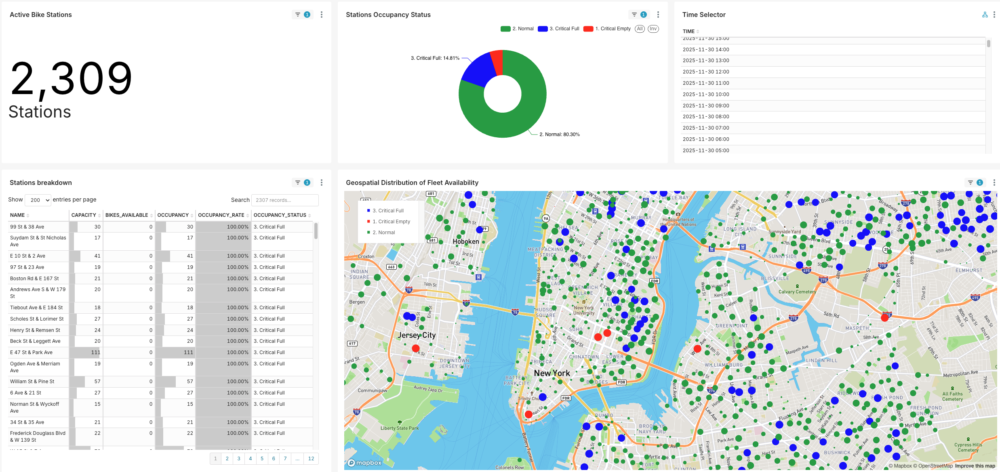
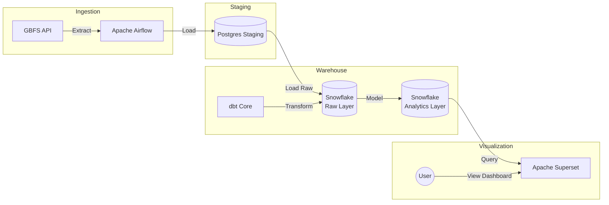
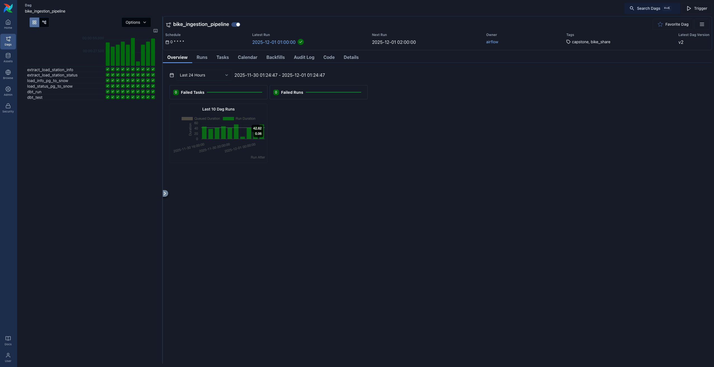
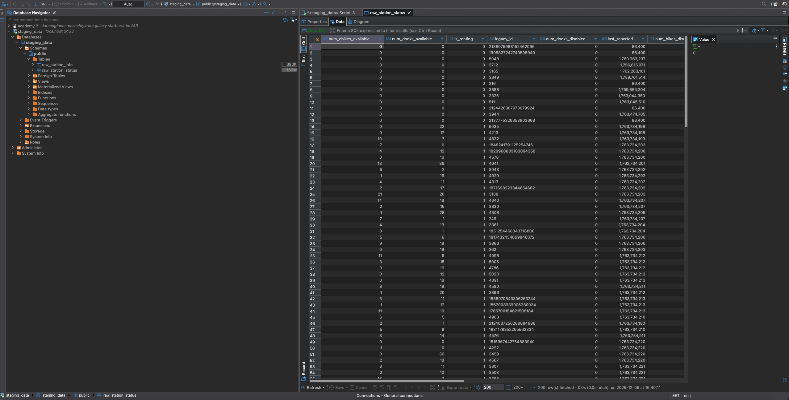
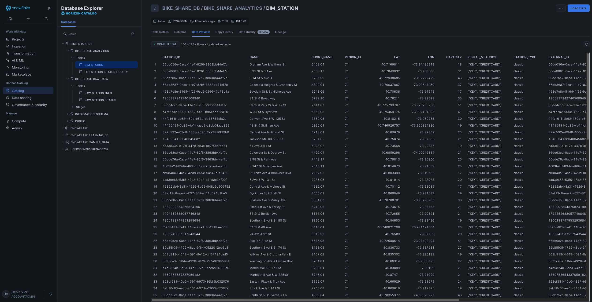

# 🚴‍♂️ NYC Bike Share Data Engineering Pipeline
A robust, end-to-end data engineering solution that ingests, transforms, and visualizes **REAL WORLD** availability data from the NYC Citi Bike system. https://citibikenyc.com/
Primary data source: https://gbfs.org/

## 🔗 Live Demo
Explore the interactive dashboard showcasing latest hourly data on station occupancy and system trends:

## 👉 https://unabatedly-avoidable-awilda.ngrok-free.dev

Guest Credentials:

Username: guest

Password: Pass1234!

## 📖 Project Overview
This project builds a scalable data pipeline to monitor the Operational Health of the NYC Citi Bike network. It moves data from raw JSON APIs to a polished executive dashboard, enabling stakeholders to identify "Critical Empty" (stockouts) and "Critical Full" (blocked docks) stations, and act on the hourly refreshed data.

## Business Problem: Optimizing Fleet Availability & Customer Satisfaction
As a revenue-driven bike share system, Citi Bike relies on high customer satisfaction and system reliability to retain subscribers and attract casual riders. A primary friction point for users is Station Imbalance: encountering empty stations when trying to rent a bike (stockout) or full stations when trying to return one (blocked return). These service failures directly impact revenue through lost rentals and customer churn.

To mitigate this, operations teams must proactively rebalance the fleet. The core business objective is to maintain a "Normal" state across the network by identifying "Critically Full" (Blue) stations and redistributing inventory to "Critically Empty" (Red) stations. This dashboard provides visibility into network health, enabling data-driven dispatching of rebalancing trucks to minimize service interruptions and maximize fleet utilization.

## Main metrics
- Capacity: Number of docks at the station.
- Available Bikes: Number of bikes currently available for rent.
- Occupancy: Number of docks occupied by bikes.
- Occupancy Rate: Percentage of docks occupied by bikes.
- Critical Normal: Stations with 11% - 89% capacity available.
- Critical Empty: Stations with less than or equal to 10% capacity available.
- Critical Full: Stations with more than or equal to 90% capacity occupied.

## 📊 Dashboard Preview
- **FIRST THING TO DO:** On the Time Selector Chart >> Select the latest date & hour to see the current state of the bike share network.
- Station Occupany Status Chart >> Shows how many stations are in each status (Critical Empty, Normal, Critical Full). It is clickable and will filter the rest of the dashboard.
- Active Bike Stations Chart >> Total number of active bikes in the NYC CITI Bike network.
- Stations Breakdown Chart >> Shows the address of the stations and the exact metrics (capacity, available bikes, occupancy and occupancy rate).
- Geospatial Distribution Map >> Shows the location and the size (number of docks) of the stations and the status (Red = Empty, Blue = Full, Green = Normal).

## Key Features
ELT Pipeline: Extracts data from the GBFS API, loads it into PostgreSQL (Staging) and Snowflake (Warehouse), and transforms it using dbt.

Orchestration: Apache Airflow schedules hourly ingestion jobs with robust dependency management.

Data Modeling: Implements a Star Schema with Slowly Changing Dimensions (SCD) handling via dbt snapshots and incremental models. Snowflake was choosen for it's performance  as an OLAP engine powered DW versus traditional Postgres OLTP, where the staging data is stored. Using a DW with an OLAP engine speeds up significantly the querying from the BI tool perspective (Superset).

Visualization: Custom Apache Superset dashboard with deck.gl geospatial maps and cross-filtering capabilities.

## 🏗️ Architecture

## Technologies Used

Infrastructure: Docker Compose

Orchestration: Apache Airflow 3.1.2 (Running in Docker)

Transformation: dbt-core 1.7.10 (Isolated in Python Virtual Environment)

Warehouse: Snowflake (Azure Switzerland North Region)

Visualization: Apache Superset (Custom Docker build with Snowflake drivers)

Demo Tunnel: ngrok (https://dashboard.ngrok.com/get-started/setup/macos)

## 🧩 Pipeline Details
### 1. Airflow DAG (bike_ingestion_pipeline)

*Automated hourly ingestion and transformation pipeline.*
The pipeline runs @hourly and consists of 4 major steps:

Extract: Python tasks fetch station_information and station_status from the public API.

Load 1: Data is staged in a local Postgres container.

Load 2: Data is then ingested into Snowflake Dimensioanl and Fact tables.

Technical Highlight: Uses a dedicated Service User in Snowflake to bypass MFA for automated ingestion.

Transform (dbt): Airflow triggers dbt run inside an isolated virtual environment to prevent dependency conflicts.

Test: dbt test validates data quality (unique keys, not null constraints) before the pipeline finishes.

### 2. dbt Models
dim_stations: Captures static station metadata (Capacity, Name, Location).

fct_station_status_hourly: Incremental fact table storing hourly snapshots of bike availability.

Logic: Calculates occupancy_rate and assigns status buckets (Critical Empty, Normal, Critical Full).

## 🛠️ Technical Challenges Solved
Dependency Hell: Resolved conflicting importlib requirements between Airflow and dbt by isolating dbt in a custom venv within the Dockerfile.

Snowflake Security: Configured Key-Pair/Service User authentication to bypass mandatory MFA for automated pipeline tasks.

DBT Incremental Model: Implemented incremental model to avoid duplicating data and to speed up the pipeline, thus saving money on snowflake credits.

Geospatial Performance: Optimized Superset map rendering by implementing "Data Zoom" and row limiting to handle high-density NYC data without browser crashes.

## 📬 Contact
Denis Vieru