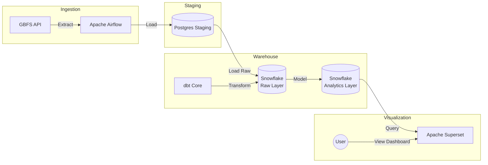

# 🚴‍♂️ NYC Bike Share Data Engineering Pipeline
A robust, end-to-end data engineering solution that ingests, transforms, and visualizes real-time availability data from the NYC Citi Bike system.

## 🔗 Live Demo
Explore the interactive dashboard showcasing real-time station occupancy and system trends:

## 👉 https://unabatedly-avoidable-awilda.ngrok-free.dev

Guest Credentials:

Username: admin

Password: admin

## 📖 Project Overview
This project builds a scalable data pipeline to monitor the Operational Health of the NYC Citi Bike network. It moves data from raw JSON APIs to a polished executive dashboard, enabling stakeholders to identify "Critical Empty" (stockouts) and "Critical Full" (blocked docks) stations, and act on the hourly refreshed data.

## Business Problem: Optimizing Fleet Availability & Customer Satisfaction
As a revenue-driven bike share system, Citi Bike relies on high customer satisfaction and system reliability to retain subscribers and attract casual riders. A primary friction point for users is Station Imbalance: encountering empty stations when trying to rent a bike (stockout) or full stations when trying to return one (blocked return). These service failures directly impact revenue through lost rentals and customer churn.

To mitigate this, operations teams must proactively rebalance the fleet. The core business objective is to maintain a "Normal" state across the network by identifying "Critically Full" (Blue) stations and redistributing inventory to "Critically Empty" (Red) stations. This dashboard provides real-time visibility into network health, enabling data-driven dispatching of rebalancing trucks to minimize service interruptions and maximize fleet utilization.

## Key Features
ELT Pipeline: Extracts data from the GBFS API, loads it into PostgreSQL (Staging) and Snowflake (Warehouse), and transforms it using dbt.

Orchestration: Apache Airflow schedules hourly ingestion jobs with robust dependency management.

Data Modeling: Implements a Star Schema with Slowly Changing Dimensions (SCD) handling via dbt snapshots and incremental models.

Visualization: Custom Apache Superset dashboard with deck.gl geospatial maps and cross-filtering capabilities.

## 🏗️ Architecture

## Technologies Used
Orchestration: Apache Airflow 3.1.2 (Running in Docker)

Transformation: dbt-core 1.7.10 (Isolated in Python Virtual Environment)

Warehouse: Snowflake (Azure Switzerland North Region)

Visualization: Apache Superset (Custom Docker build with Snowflake drivers)

Infrastructure: Docker Compose

## 🧩 Pipeline Details
### 1. Airflow DAG (bike_ingestion_pipeline)
The pipeline runs @hourly and consists of 4 major steps:

Extract: Python tasks fetch station_information and station_status from the public API.

Load: Data is staged in a local Postgres container and then merged into Snowflake raw tables.

Technical Highlight: Uses a dedicated Service User in Snowflake to bypass MFA for automated ingestion.

Transform (dbt): Airflow triggers dbt run inside an isolated virtual environment to prevent dependency conflicts.

Test: dbt test validates data quality (unique keys, not null constraints) before the pipeline finishes.

### 2. dbt Models
dim_stations: Captures static station metadata (Capacity, Name, Location).

fct_station_status_hourly: Incremental fact table storing hourly snapshots of bike availability.

Logic: Calculates occupancy_rate and assigns status buckets (Critical Empty, Normal, Critical Full).

## 📊 Dashboard Highlights
The Superset dashboard focuses on operational insights:

Traffic Light Map: A deck.gl Scatterplot that color-codes stations by health (Red = Empty, Blue = Full, Green = Normal).

Time Travel: A bar chart acting as a timeline scrubber; clicking a bar filters the map to that historical hour.

Drill-down Table: Detailed list of stations requiring immediate rebalancing.

## ⚙️ Setup & Installation
Prerequisites
Docker & Docker Compose

Snowflake Account 

Mapbox API Key (for Superset)

### 1. Clone the Repository
Bash

git clone https://github.com/your-username/bike-share-de-project.git
cd bike-share-de-project
### 2. Configuration
Create a .env file or export the following variables:

Bash

AIRFLOW_UID=50000
SNOWFLAKE_ACCOUNT=your_account_id
SNOWFLAKE_USER=airflow_service_user
SNOWFLAKE_PASSWORD=your_password
MAPBOX_API_KEY=pk.eyJ...
### 3. Build & Run
Bash

docker-compose up --build -d
### 4. Access Interfaces
Airflow: http://localhost:8080 (User/Pass: airflow)

Superset: http://localhost:8088 (User/Pass: admin)

## 🛠️ Technical Challenges Solved
Dependency Hell: Resolved conflicting importlib requirements between Airflow and dbt by isolating dbt in a custom venv within the Dockerfile.

Snowflake Security: Configured Key-Pair/Service User authentication to bypass mandatory MFA for automated pipeline tasks.

Geospatial Performance: Optimized Superset map rendering by implementing "Data Zoom" and row limiting to handle high-density NYC data without browser crashes.

## 📬 Contact
Denis Vieru